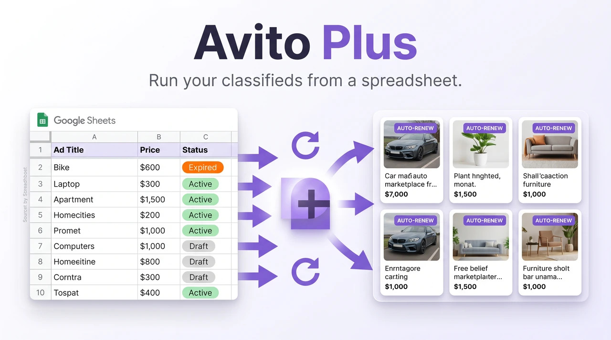
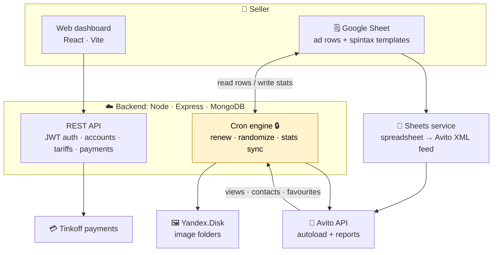
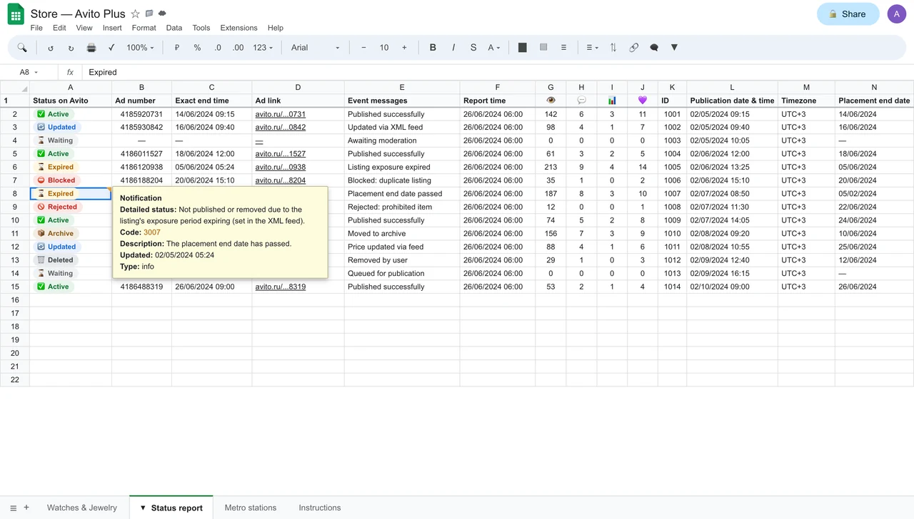
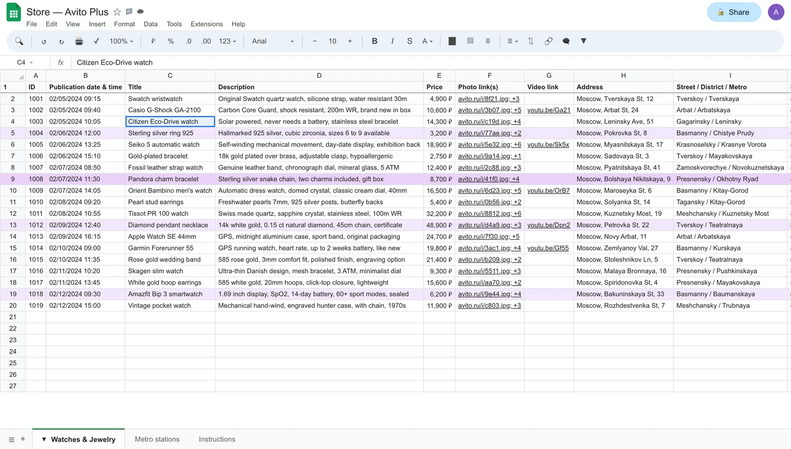
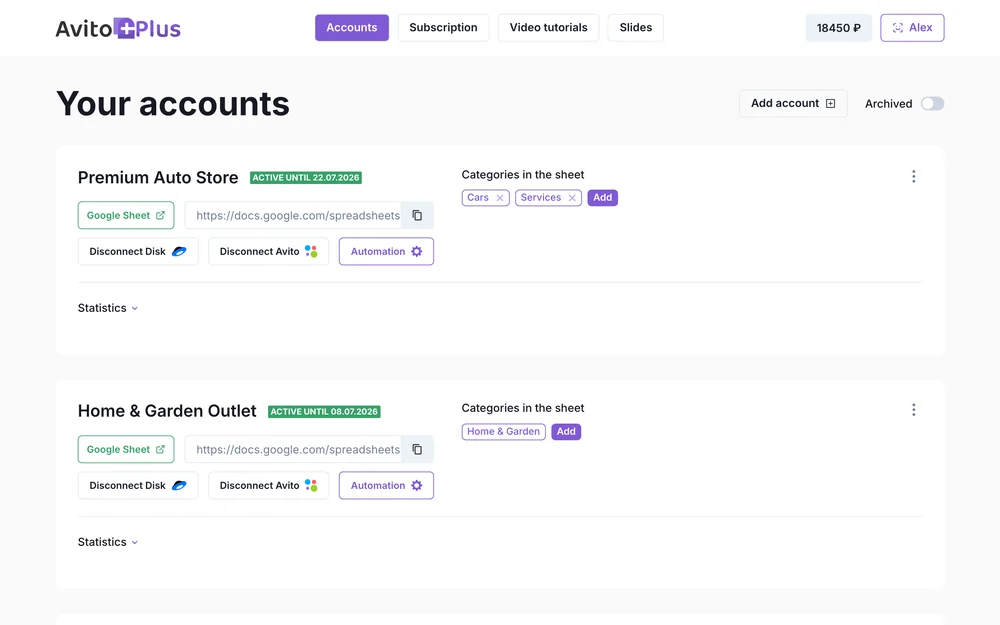
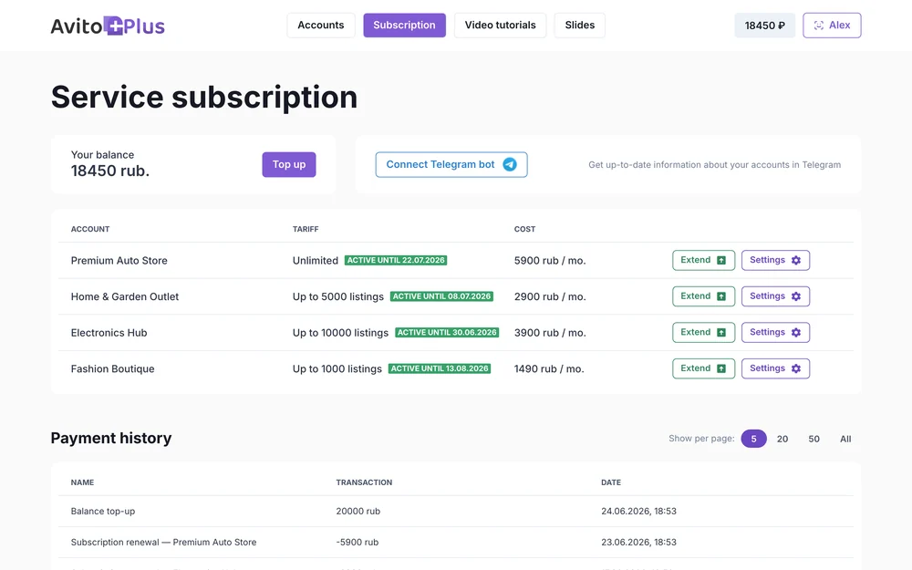
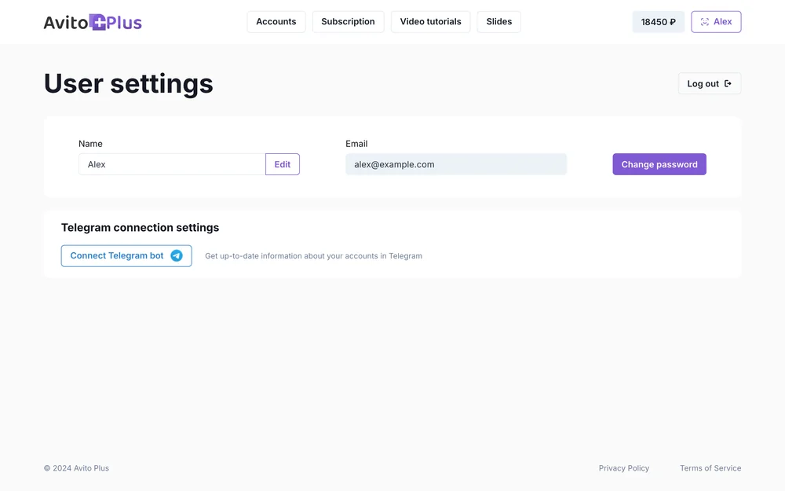
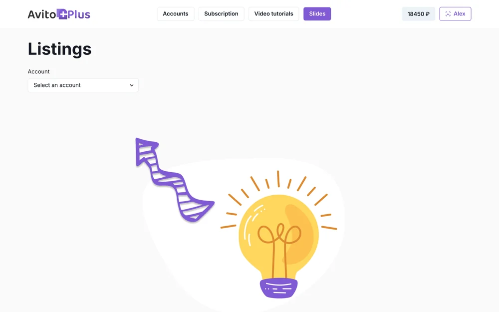
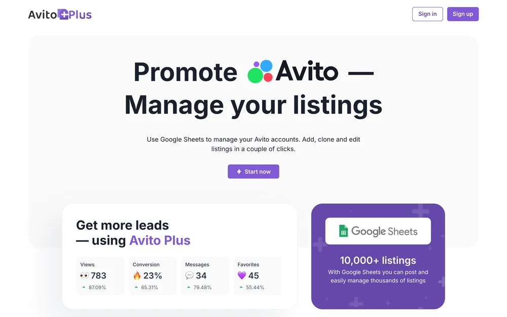
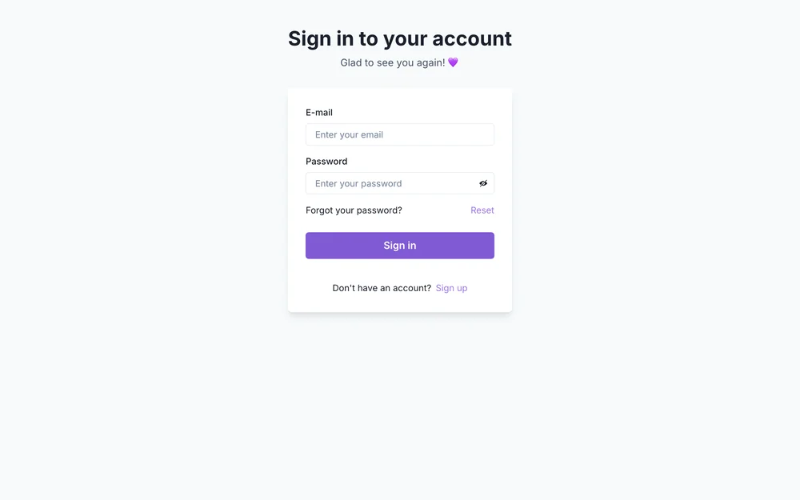

<div align="center">

# 📋 Avito Plus

**A Google-Sheets-driven automation platform for classified ads.**
Sellers manage their listings from a spreadsheet; the engine auto-duplicates and renews ads, randomizes the copy to stay fresh, syncs live stats back into the sheet, and feeds it all to the marketplace, with payments and a web dashboard on top.


[Architecture](#-architecture) · [How it works](#-how-it-works) · [Screenshots](#-screenshots) · [Build & run](#-build--run)

<br/>


</div>

---

## What it is

**Avito Plus** is a SaaS that automates selling on a large classifieds marketplace (Avito). A seller keeps their listings as rows in a **Google Sheet**: title, description, price templates, image folders, schedule. The platform turns that sheet into a live ad feed and keeps the listings healthy automatically:

- 🔁 **Auto-renewal**: blocked or expired ads are re-published with a fresh id and refreshed dates, so listings never silently die.
- 🎲 **Copy randomization**: title / description / price are regenerated from spintax templates on each cycle, so re-posted ads don't read as duplicates.
- 📊 **Live stats sync**: views, contacts, and favourites (1 / 7 / 30 days) are pulled from the marketplace API and written **back into the sheet**.
- 🗂️ **Sheets as the data plane**: the spreadsheet *is* the source of truth; a small service transposes it directly into the marketplace's autoload **XML feed**.
- 💳 **Accounts, tariffs & payments**: JWT auth, subscription tariffs, and Tinkoff payment integration, driven from a **React** dashboard.

## 🏗 Architecture



## ⚙️ How it works

1. **The sheet is the database.** Each ad is a column in a Google Sheet (row 1 = the marketplace XML tag, rows 3+ = values). The **sheets service** reads the spreadsheet via the Google Sheets API and transposes it straight into the Avito **autoload XML** the marketplace ingests.
2. **Cron engine keeps ads alive.** Scheduled jobs (secured by a shared secret) walk every account: pull the latest report, detect `Blocked` / `Expired` listings, mint a new `nanoid` id, refresh begin/end dates, and re-randomize the copy from templates, then write the result back to the sheet.
3. **Stats flow back.** The engine reads marketplace stats (views / contacts / favourites over 1 / 7 / 30 days) and writes them into the sheet so the seller sees performance where they already work.
4. **Images by reference.** Image-folder columns resolve to direct **Yandex.Disk** links at feed time.
5. **Payments.** Tariffs and Tinkoff payments are managed from the React dashboard.

## ✨ Engineering highlights

> This repository has been hardened and documented for a public showcase.

- 🔒 **Secured automation**: the cron endpoints require a `CRON_SECRET` (header or query) and 401 without it.
- 🧪 **Tested**: a **Vitest** suite covers the core pure logic (spintax randomizer, id minting, the sheet-transpose transform).
- 🧱 **Robust API**: a central async error handler + input validation middleware give consistent JSON errors instead of unhandled rejections.
- 🪵 **Structured logging**: centralized log4js (with morgan piped through it).
- 🧩 **Modular**: clean `routes / services / models / middleware` separation; integrations isolated per provider.
- 🔑 **Secrets out**: every credential is an `.env.example` / `auth.example.json` placeholder; bring your own keys.

## 📸 Screenshots

**The control panel is a Google Sheet.** Listings, live Avito statuses, and the renewal/event log all live in the spreadsheet the seller already uses:

<table>
<tr>
<td width="50%"><br/><sub>Live ad statuses (Active · Expired · Blocked · Updated) + the event/notification log</sub></td>
<td width="50%"><br/><sub>The catalog sheet: listings, prices, photos, metro</sub></td>
</tr>
</table>

**The web dashboard** manages ad accounts, automation, subscriptions, and content:

<table>
<tr>
<td width="33%"><br/><sub>Accounts: connect a sheet, toggle automation</sub></td>
<td width="33%"><br/><sub>Subscription &amp; tariffs</sub></td>
<td width="33%"><br/><sub>Settings</sub></td>
</tr>
<tr>
<td width="33%"><br/><sub>Promo slides</sub></td>
<td width="33%"><br/><sub>Landing page</sub></td>
<td width="33%"><br/><sub>Sign in</sub></td>
</tr>
</table>

<sub>The web dashboard is rendered from the real React app (sample data via a mock API); the Google Sheet views are clean English recreations of the live control panel.</sub>

---

## 📁 Repository structure

```text
avito-plus-case/
├── backend/   Node/Express API + cron automation engine (the core) - Vitest tests
├── web/       React/Vite seller dashboard
├── sheets/    Google Sheets → Avito-XML feed service
├── infra/     Docker Compose (nginx + services + MongoDB)
└── docs/      Architecture notes
```

Each component has its own README and `.env.example`.

## 🚀 Build & run

<details>
<summary><b>Backend (API + cron engine)</b></summary>

```bash
cd backend
cp .env.example .env                                  # DB / JWT / Avito / Yandex / SendGrid / CRON_SECRET
cp server/services/Google/auth/auth.example.json \
   server/services/Google/auth/auth.json              # your GCP service-account key
npm install
npm test          # Vitest
npm start
```
See [`backend/README.md`](backend/README.md).
</details>

<details>
<summary><b>Web dashboard · Sheets service · Infra</b></summary>

```bash
cd web    && cp .env.example .env && npm install && npm run dev   # VITE_API_URL
cd sheets && npm install && node server.js                        # GET /data?id=<spreadsheetId>
cd infra  && cp .env.example .env && docker compose up --build    # bring your own Google key + TLS cert
```
See each folder's README.
</details>

## 📄 License

Released under the [MIT License](LICENSE).

## 👤 Author

**Alex Polezhaev**, full-stack engineer.
I build end-to-end products across backends, web, automation, and integrations. **Relocating to the United States, open to roles.**

- GitHub: [@alex-polezhaev](https://github.com/alex-polezhaev)
- Email: polezhaev.advert@gmail.com
